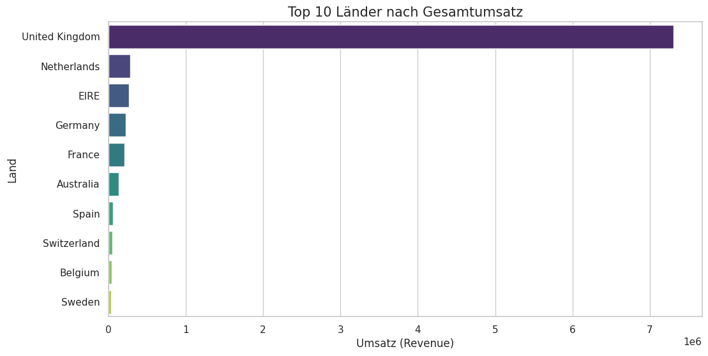
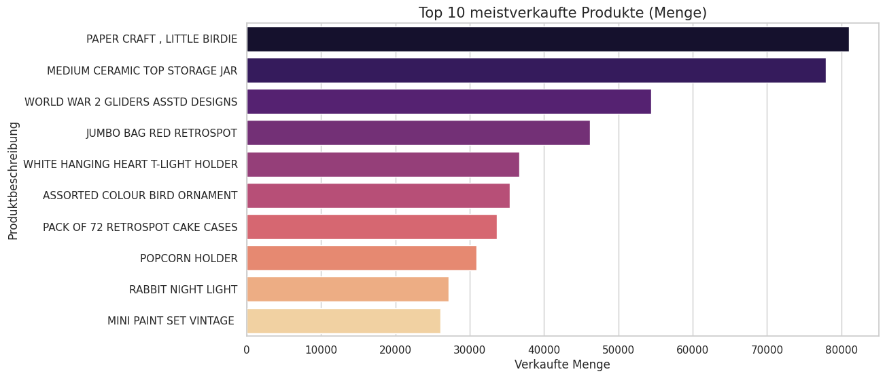
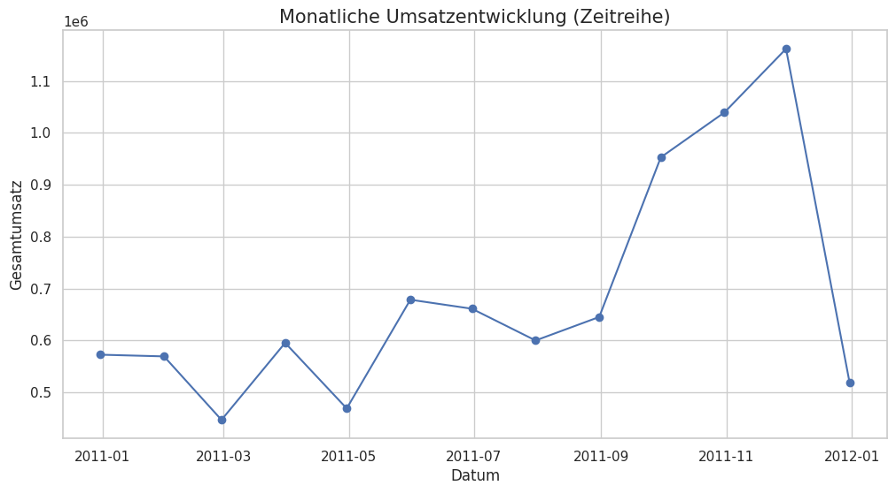

# Online-Retail Datenanalyse & AWS Cloud Integration

Dieses Projekt zeigt einen vollständigen **Data Engineering & Science Workflow**. Es umfasst den gesamten Prozess von der Extraktion der Rohdaten aus der **AWS S3 Cloud** über eine intensive Bereinigung bis hin zur fortgeschrittenen Kunden-Segmentierung mittels RFM-Analyse.

---

## Projektübersicht
Das Hauptziel dieses Projekts ist die Verarbeitung eines umfangreichen Datensatzes aus dem Online-Einzelhandel. Dabei wurden technische Hürden wie fehlende Werte und inkonsistente Datentypen überwunden, um fundierte betriebswirtschaftliche Erkenntnisse zu gewinnen.

## Technologien & Tools
*   **Python:** Kernsprache für die Analyse.
*   **Pandas:** Zur effizienten Datenmanipulation.
*   **Boto3:** Für die direkte Kommunikation mit **Amazon Web Services (AWS)**.
*   **Matplotlib & Seaborn:** Zur Erstellung der Datenvisualisierungen.
*   **RFM-Analyse:** Ein Modell zur Bewertung des Kundenwerts.

---

## Workflow & Funktionen

### 1. Cloud-Datenextraktion
Das Skript verbindet sich sicher mit einem **S3 Bucket**. Unter Verwendung von AWS-Zugangsdaten werden die Rohdaten (`Online Retail.xlsx`) direkt in die Umgebung geladen.

### 2. Datenbereinigung (Data Cleaning)
Rohdaten sind oft unvollständig. In diesem Schritt haben wir:
*   Zeilen ohne `CustomerID` oder `Description` entfernt.
*   Ungültige Transaktionen mit Mengen oder Preisen von Null oder weniger gefiltert.
*   Das `InvoiceDate` in ein einheitliches Datetime-Objekt konvertiert.

---

## Visualisierungen & Insights

Hier sind die wichtigsten Erkenntnisse aus der Datenanalyse:

### 1. Monatliche Umsatzentwicklung
Diese Zeitreihe zeigt die Entwicklung des Gesamtumsatzes über den Analysezeitraum.

### 2. Top 10 Meistverkaufte Produkte
Die Analyse der meistverkauften Artikel hilft bei der Lagerbestandsplanung.

### 3. Top 10 Länder nach Umsatz
Identifikation der profitabelsten Märkte weltweit.

---

## RFM-Kunden-Segmentierung
Um den Kundenstamm besser zu verstehen, wurde eine **RFM-Analyse** implementiert:
*   **Recency (Aktualität):** Tage seit dem letzten Kauf.
*   **Frequency (Häufigkeit):** Anzahl der getätigten Käufe.
*   **Monetary (Umsatz):** Gesamtwert der Ausgaben des Kunden.

> [!TIP]
> **Sicherheitshinweis:** Beim Ausführen des Notebooks werden die AWS-Zugangsschlüssel sicher über die `getpass`-Funktion abgefragt. Dies stellt sicher, dass keine sensiblen Anmeldedaten im Quellcode gespeichert werden.

---
**Datenquelle:** Online Retail Dataset - `ana1.ipynb`
